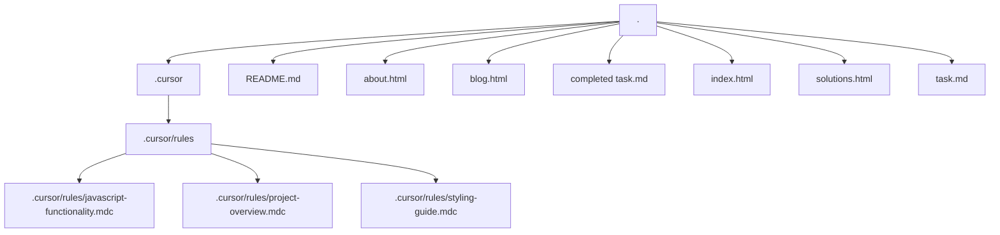

```mermaid
graph TD
    A[.] --> B[.cursor]
    B --> C[.cursor/rules]
    C --> D[.cursor/rules/javascript-functionality.mdc]
    C --> E[.cursor/rules/project-overview.mdc]
    C --> F[.cursor/rules/styling-guide.mdc]
    A --> G[README.md]
    A --> H[about.html]
    A --> I[blog.html]
    A --> J[completed task.md]
    A --> K[index.html]
    A --> L[solutions.html]
    A --> M[task.md]
```
